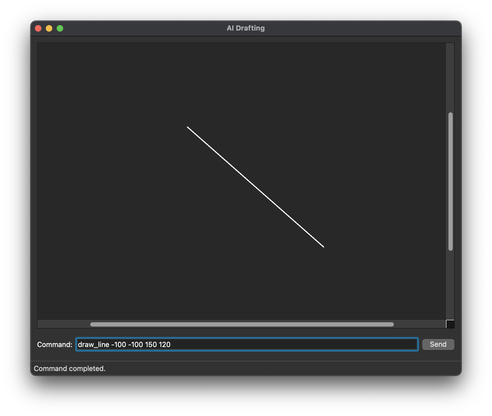

# AI-CAD

A CAD-like tool that integrates an AI assistant.

## Goals

- Build a lightweight 2D drafting application
- Provide deterministic CAD operations
- Allow an AI assistant to invoke approved drafting commands
- Explore natural language driven design workflows

## Tech Stack

- Python
- PySide6
- Qt Graphics View Framework